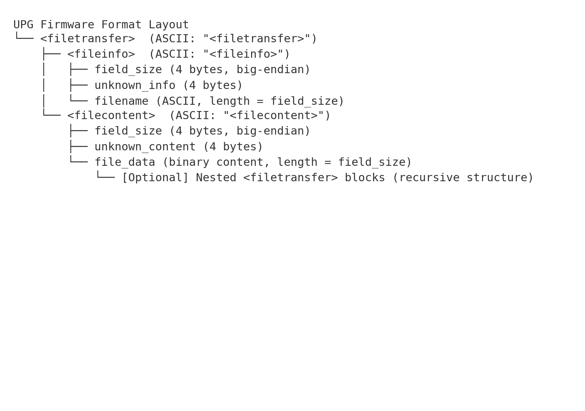

# Autel UPG Recursive Extraction Pipeline

This bundle includes all scripts, summaries, and instructions to fully replicate the extraction and recursive unpacking of Autel firmware UPG packages.

## 📂 Contents
- `autel_upg_extractor_corrected.py` : Top-level UPG file extractor
- `autel_upg_extractor_recursive_final.py` : Recursive extractor for files found within extracted data
- `upg_archive_scanner.py` : Scanner for embedded archives (ZIP, LZMA, TAR, YAFFS2)
- `replicate_upg_recursive_pipeline.sh` : Shell script to run the full pipeline step-by-step
- Summary CSV files for each stage
- Extracted folders: `top_level_extracted/`, `extracted_recursive/`, etc.

## 📐 Format Layout Diagram
Below is the structure of the UPG file format and how it's parsed:



## 🛠 Requirements
- Python 3.x
- `pandas` (install with `pip install pandas`)

## ▶ Usage

### Step 1: Extract top-level UPG content
```bash
python3 autel_upg_extractor_corrected.py -i Model-C_FW_V2.7.25.bin -o top_level_extracted -s top_level_extracted_summary.csv
```

### Step 2: Recursively scan extracted `.bin` files
```bash
python3 autel_upg_extractor_recursive_final.py -i top_level_extracted/at_Model-C_FW_V2.7.25.bin -o extracted_recursive -s recursive_subextracted_summary.csv
```

### Step 3: Deeper recursive scan (optional)
```bash
python3 autel_upg_extractor_recursive_final.py -i extracted_recursive/some_nested_file.bin -o deeper_recursive -s recursive_deep_subextracted_summary.csv
```

### Step 4: Scan for embedded archives
```bash
python3 upg_archive_scanner.py -i extracted_recursive/ -o archive_scanned_output/
```

### Or use the full automated pipeline:
```bash
chmod +x replicate_upg_recursive_pipeline.sh
./replicate_upg_recursive_pipeline.sh Model-C_FW_V2.7.25.bin
```

## 💡 Notes
- The scripts use hex-pattern matching for custom tags like `<filetransfer>`, `<fileinfo>`, and `<filecontent>`.
- You can extend the recursive scanning further by repeating steps for newly discovered `.bin` or `.upg` files.
